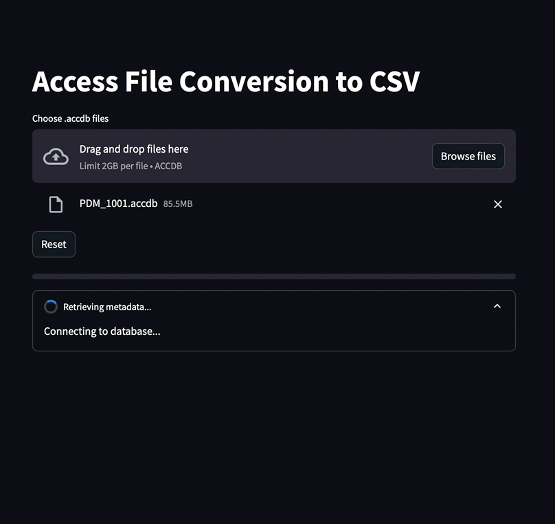

# CSV Manager

CSV Manager is an application for converting Access database files to CSV. This README provides instructions for installing and using the application for both novice and advanced users.

<p align="center">
  
</p>


## Prerequisites

- Docker Desktop: [Download Docker](https://www.docker.com/products/docker-desktop)

## Application Features

Upload your Access files to convert them into CSV.

## Installation and Usage

### For Users Not Familiar with GitHub and Terminal

1. **Download the Application**

   Download and extract the [provided ZIP file](csv-manager.zip).

2. **Install Docker Desktop**

   If not already installed, download and install Docker Desktop from [Docker](https://www.docker.com/products/docker-desktop). Follow the installation instructions for your operating system.

3. **Run the Application**

   - For **Windows** users:
     1. Go to the docker directory in the extracted directory.
     2. Double-click the `start.bat` file.
     3. Open a web browser and navigate to `http://localhost:8501` to access the application. (or click on this link: [CIAO ACCESS!!!!](https://localhost:8501))

   - For **macOS/Linux** users:
     1. Open the Terminal application.
     2. Navigate to the extracted directory using the `cd` command. For example:
        ```sh
        cd ~/Downloads/csv-manager/docker
        ```
     3. Make the `start.sh` script executable (if not done already):
        ```sh
        chmod +x start.sh
        ```
     4. Execute the script:
        ```sh
        ./start.sh
        ```
     5. Open a web browser and navigate to `http://localhost:8501` to access the application. (or click on this link: [CIAO ACCESS!!!!](https://localhost:8501))

### For Users Familiar with GitHub and Terminal

1. **Clone the Repository**

   Clone this repository to your local machine:

   ```bash
   git clone https://github.com/n-pizzetta/csv-manager.git
   cd csv-manager/docker
   ```

2. **Using the Makefile**

   - **Build the Docker Image**:
     ```bash
     make build
     ```

   - **Run the Docker Container**:
     ```bash
     make run
     ```

   - **Access the Application**:
     Open a web browser and navigate to `http://localhost:8501`.

   - **Stop the Docker Container**:
     ```bash
     make stop
     ```

   - **Clean Up Docker Images**:
     ```bash
     make clean
     ```
   
   - **Restart the Application**:
     ```bash
     make restart
     ```

## Troubleshooting

If you encounter issues with running the application or resource monitoring tools, ensure that:
- Docker Desktop is running.
- The correct permissions are set for mounted volumes.
- The Docker container has sufficient memory and CPU resources allocated.

For further assistance, please refer to the Docker documentation or contact the project maintainers.

## License

This project is licensed under the MIT License. See the [LICENSE](MIT-LICENSE.txt) file for details.

---

Thank you for using CSV Manager! If you have any questions or feedback, please contact me by [email](mailto:nathan.pizzetta@gmail.com).